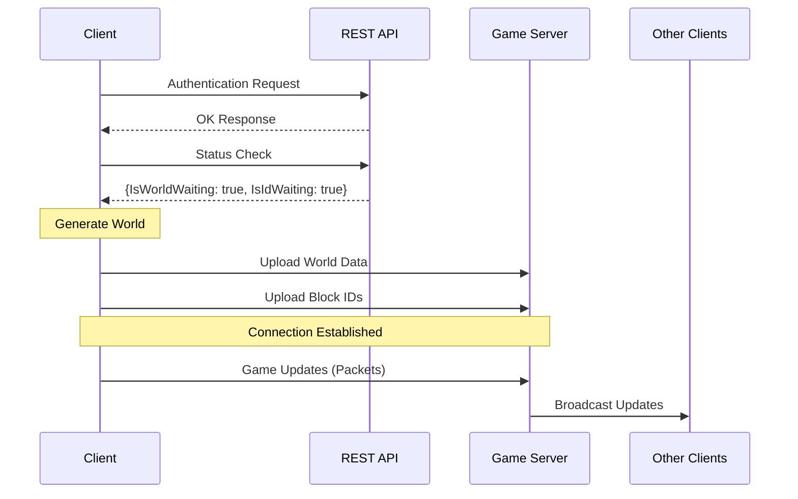

# Architecture Documentation

This document describes the network architecture and packet flow of the game.

## Connection Flow

## Architecture Overview

The game uses a hybrid architecture combining REST API for authentication and initial setup, and WebSocket for real-time game communication.

### 1. Authentication Phase
- Client sends authentication request to REST API
- REST API validates credentials and returns OK if successful

### 2. World Initialization Phase
- Client checks server status via REST API
- If server needs world data (IsWorldWaiting: true) or block IDs (IsIdWaiting: true), client uploads them
- This happens only for the first connecting client

### 3. Game Communication Phase
- All connected clients send game update packets to server
- Server acts as a packet broadcaster, forwarding all received packets to al
